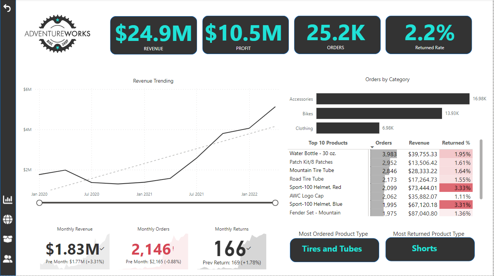
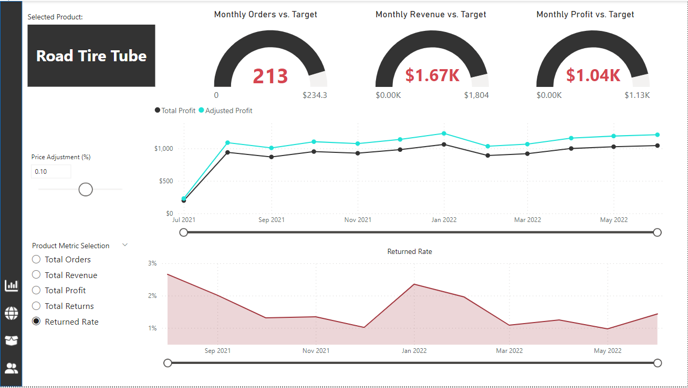
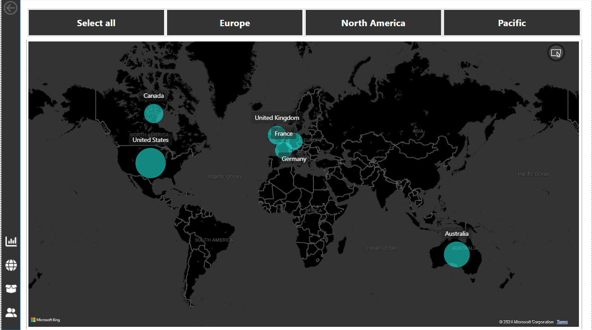
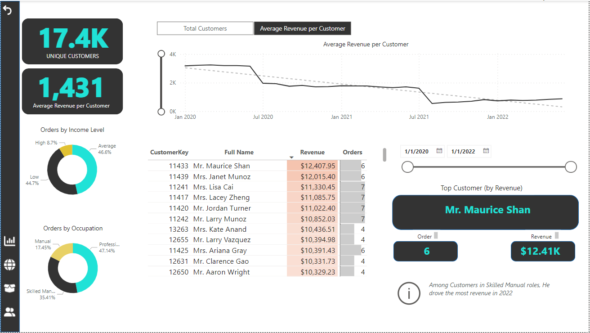

# Bike-Shopping-Report by Power BI
In this project, we are tasked with tracking KPIs (sales, revenue, profit, returns), comparing regional performance, analyzing product-level trends, and identifying high-level customers for a hypothetical bike company.

# Exec Dashboard

In this page, we have high-level KPIs that the leadership team cares about: revenue, profit, order, and return rate. We've got a nicely revenue trending chart here as well. We use some Intractive elements that Power Bi offers like sliders to zoom in one specific time periods, custom tool tips. We can drill into any specific product to take us to our product detail view.

# Product Detail

In this page we present a detail view for each product you selected from main page. it shows us things like how a product is performing against its monthly order, revenue, or profit target. We use parameters for what if analysis.  in this case, how does it change to the price, impact a metric like total profit. We utilize field parameter to make charts more interactive and dynamic for end users.

# Map

In this page, we show the regional performance and are able to compare total revenue gained by different regions.

# Customer Detail

We build a customer-level view to drill into performance at the individual customer level and break down different customer profiles and segments. We can see who the top customer is in each time period.
